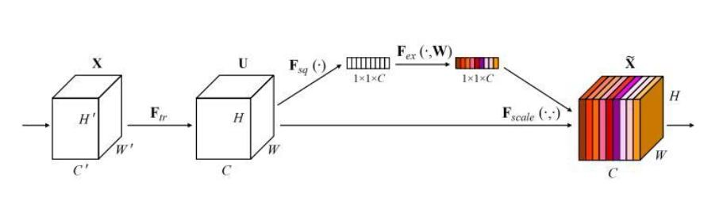
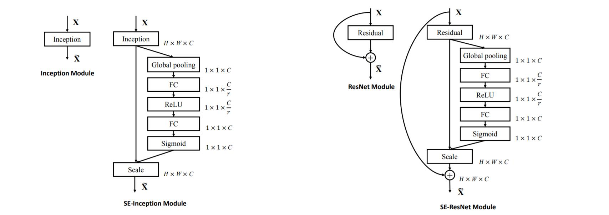
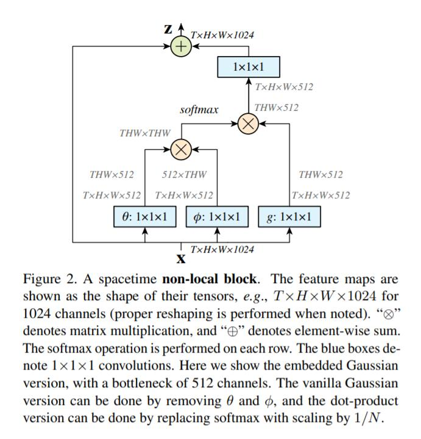

# CV Attention Models Reproduction
pytorch-version implementation codes of some CV attention models

All attention models here are plug-and-play blocks

Keep updating, just enjoy using them!

## model zoo

### Squeeze-and-Excitation Network(SEnet)

SENet mainly learns the correlation between channels, filters out the attention for channels, slightly increases the amount of computation, but the effect is better.

### Non-local Neural Networks

a pytorch implementation of [Non-local Neural Networks](https://arxiv.org/abs/1711.07971)

